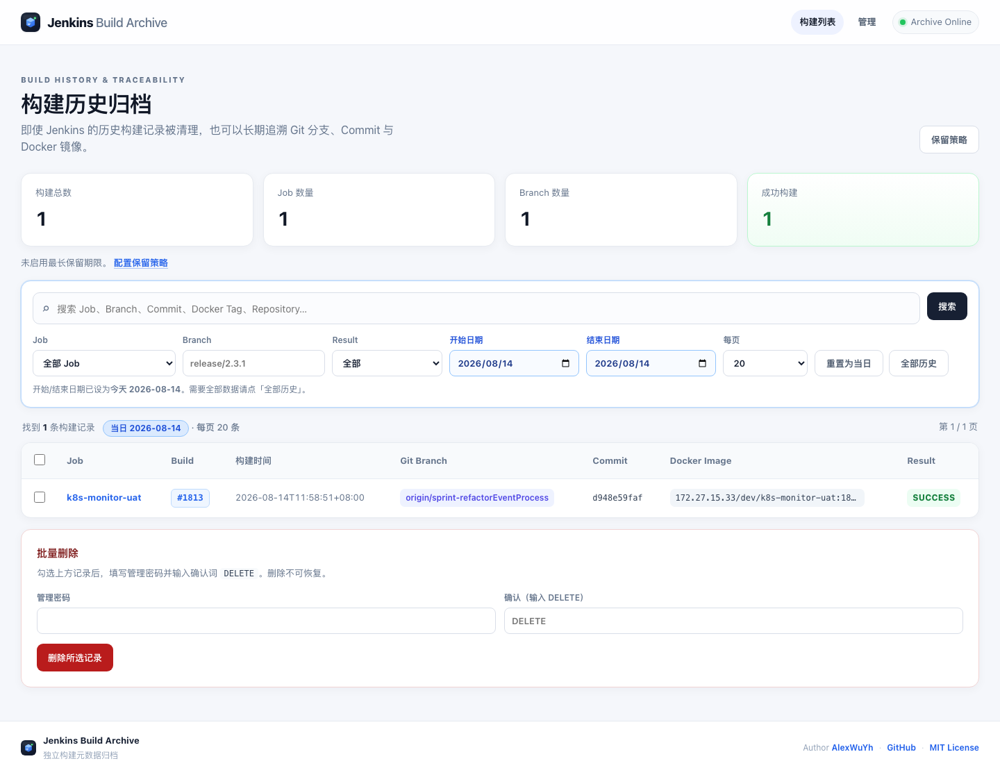

# Jenkins Build Archive

独立于 Jenkins 的**构建元数据归档服务**。在 Build Record 被清理后，仍可追溯 Git 分支 / Commit、Docker Image Tag / Digest 等信息。

面向**内网**使用：写接口使用 `API_TOKEN`，Web 管理使用 `ADMIN_PASSWORD`。



---

## 目录

1. [功能特性](#功能特性)
2. [快速开始](#快速开始)
3. [数据与备份](#数据与备份)
4. [Jenkins 接入与 Jenkinsfile](#jenkins-接入与-jenkinsfile)
5. [Docker Image Digest](#docker-image-digest)
6. [HTTP API](#http-api)
7. [Web 管理与保留策略](#web-管理与保留策略)
8. [升级](#升级)
9. [开发与测试](#开发与测试)
10. [安全说明](#安全说明)
11. [许可](#许可)

---

## 功能特性

- **归档写入**：Jenkins HTTP API / Shared Library；`(jobName, buildId)` 幂等
- **查询展示**：Web UI + REST；Job / 分支 / Commit / Tag 搜索与筛选
- **Commit 详情**：`commitMsg` / `commitAuthor` / `commitFiles`（详情页）；SHA 统一显示在 Git 信息的 Commit（`gitCommit` 与 `commitId` 互相回填）
- **默认当日**：列表页开始/结束日期默认当天（`TZ`）；「全部历史」=`/?all=1`
- **管理能力**：管理密码删除 / 批量删除；最长保留天数等策略
- **运维友好**：Docker Compose、健康检查、归档失败不影响 Jenkins 结果

---

## 快速开始

### 1. 准备配置

```bash
mkdir -p /opt/jenkins-build-archive && cd /opt/jenkins-build-archive
# 克隆或复制本仓库文件
cp .env.example .env
```

编辑 `.env`：

```dotenv
API_TOKEN=请替换成足够长的随机字符串
ADMIN_PASSWORD=请设置管理密码
TZ=Asia/Shanghai
RETENTION_DAYS=365
RETENTION_MAX_PER_JOB=0
```

### 2. 启动

```bash
docker compose up -d --build
curl http://127.0.0.1:8080/health
```

浏览器访问：`http://服务器IP:8080`（建议仅内网或经反代）。

---

## 数据与备份

| 路径 | 说明 |
|------|------|
| `./data/build_archive.db` | SQLite 主库（volume 挂载） |

```bash
# 简单拷贝
cp data/build_archive.db data/build_archive.db.$(date +%Y%m%d-%H%M%S).bak

# 在线备份（推荐）
docker exec jenkins-build-archive python -c \
  "import sqlite3; s=sqlite3.connect('/data/build_archive.db'); d=sqlite3.connect('/data/backup.db'); s.backup(d); d.close(); s.close()"
```

---

## Jenkins 接入与 Jenkinsfile

流水线**结束时**（成功/失败均）将元数据 `POST` 到归档服务。  
**推荐 Shared Library `buildArchive()`**；也可在 Jenkinsfile 内直接 `curl`。

### 一次性配置

**全局环境变量**（Manage Jenkins → System → Global properties）：

| 变量 | 示例 | 说明 |
|------|------|------|
| `BUILD_ARCHIVE_URL` | `http://172.27.x.x:8080` | 服务根地址，无尾部 `/` |
| `BUILD_ARCHIVE_TOKEN` | 与 `.env` 的 `API_TOKEN` 相同 | 建议用 Credentials（Secret text） |

**Shared Library**（Global Pipeline Libraries）：

| 项 | 值 |
|----|-----|
| Name | `build-archive` |
| Source | 本仓库（含 `vars/buildArchive.groovy`） |

Agent 需有 `curl`。细节见 [`jenkins-shared-library/README.md`](./jenkins-shared-library/README.md)。

### 推荐 Jenkinsfile（Declarative）

```groovy
@Library('build-archive') _

pipeline {
    agent any

    options {
        buildDiscarder(logRotator(numToKeepStr: '20'))
        timestamps()
    }

    environment {
        // 可选覆盖；Token 建议 credentials('build-archive-api-token')
        // BUILD_ARCHIVE_URL = 'http://172.27.x.x:8080'
    }

    stages {
        stage('Checkout') {
            steps { checkout scm }
        }
        stage('Build') {
            steps { sh 'echo build...' }
        }
        stage('Docker') {
            steps {
                script {
                    env.DOCKER_REGISTRY = '172.27.15.33'
                    env.DOCKER_REPOSITORY = 'dev/dp-abcmonitor'
                    env.DOCKER_IMAGE_TAG = "${env.DOCKER_REGISTRY}/${env.DOCKER_REPOSITORY}:${env.BUILD_NUMBER}"
                    // env.DOCKER_IMAGE_DIGEST = 'sha256:....'
                }
            }
        }
    }

    post {
        always {
            buildArchive()   // 必须 always，失败构建也会入库
        }
    }
}
```

### 字段映射

| 归档字段 | Jenkins 来源 |
|----------|----------------|
| jobName | `JOB_NAME` |
| buildId | `BUILD_NUMBER`（正整数） |
| buildDate | `BUILD_TIMESTAMP` 或当前时间（上海时区） |
| gitRepository | `GIT_URL` / `GIT_REPO` |
| gitBranch | `GIT_BRANCH` / `BRANCH_NAME` |
| gitCommit | `GIT_COMMIT` |
| commitMsg | `commitMsg` / `COMMIT_MSG` 或 `buildArchive(commitMsg: …)` |
| commitAuthor | `commitAuthor` / `COMMIT_AUTHOR` 或 call 参数 |
| commitId | `commitId` / `COMMIT_ID`（默认回退 `GIT_COMMIT`） |
| commitFiles | `commitFiles` / `COMMIT_FILES`（List / JSON 数组字符串 / 换行分隔） |
| dockerRegistry / Repository / Tag / Digest | `DOCKER_*` 或 `DockerImageTag` |
| buildResult | `currentBuild.currentResult` |
| buildUrl | `BUILD_URL` |
| durationMs | `config.durationMs` → `currentBuild.duration` → 自 `startTimeInMillis` 推算（构建未结束时常为 null/0） |

### 推送镜像并写入 Digest

```groovy
stage('Push image') {
    steps {
        script {
            def tag = "172.27.15.33/dev/my-app:${env.BUILD_NUMBER}"
            env.DOCKER_IMAGE_TAG = tag
            sh "docker build -t ${tag} . && docker push ${tag}"
            env.DOCKER_IMAGE_DIGEST = sh(
                script: "docker inspect --format='{{index .RepoDigests 0}}' ${tag} | awk -F@ '{print \$2}'",
                returnStdout: true
            ).trim()
        }
    }
}
post { always { buildArchive() } }
```

### 附带 Commit 详情示例

```groovy
stage('Collect commit') {
    steps {
        script {
            env.commitId = sh(script: 'git rev-parse HEAD', returnStdout: true).trim()
            env.commitAuthor = sh(script: 'git log -1 --pretty=format:%an', returnStdout: true).trim()
            env.commitMsg = sh(script: 'git log -1 --pretty=format:%B', returnStdout: true).trim()
            env.commitFiles = sh(script: 'git diff-tree --no-commit-id --name-only -r HEAD', returnStdout: true).trim()
        }
    }
}
post {
    always {
        buildArchive()
        // 或：buildArchive(commitMsg: env.commitMsg, commitAuthor: env.commitAuthor, commitId: env.commitId, commitFiles: env.commitFiles.readLines())
    }
}
```

详情页：Git 信息展示 Commit SHA（`gitCommit` 缺省或为 `"-"` 等占位符时回退 `commitId`）；Commit 详情展示 Author / Message / Files（不再重复 commitId）。

### 不使用 Shared Library（curl）

```groovy
pipeline {
    agent any
    environment {
        BUILD_ARCHIVE_URL   = 'http://172.27.x.x:8080'
        BUILD_ARCHIVE_TOKEN = credentials('build-archive-api-token')
    }
    stages {
        stage('Build') { steps { sh 'echo build' } }
    }
    post {
        always {
            script {
                def payload = [
                    jobName: env.JOB_NAME,
                    buildId: env.BUILD_NUMBER as Integer,
                    buildDate: new Date().format("yyyy-MM-dd'T'HH:mm:ssXXX", TimeZone.getTimeZone('Asia/Shanghai')),
                    gitRepository: env.GIT_URL,
                    gitBranch: env.GIT_BRANCH ?: env.BRANCH_NAME,
                    gitCommit: env.GIT_COMMIT,
                    dockerImageTag: env.DOCKER_IMAGE_TAG,
                    dockerImageDigest: env.DOCKER_IMAGE_DIGEST,
                    buildResult: currentBuild.currentResult ?: 'UNKNOWN',
                    buildUrl: env.BUILD_URL,
                    durationMs: currentBuild.duration
                ]
                def file = "build-archive-${env.BUILD_NUMBER}.json"
                try {
                    writeFile file: file, text: groovy.json.JsonOutput.toJson(payload)
                    withEnv([
                        "BUILD_ARCHIVE_POST_URL=${env.BUILD_ARCHIVE_URL.replaceAll('/+$', '')}/api/v1/builds",
                        "BUILD_ARCHIVE_POST_TOKEN=${env.BUILD_ARCHIVE_TOKEN}",
                        "BUILD_ARCHIVE_PAYLOAD_FILE=${file}",
                    ]) {
                        sh '''
                            set +x
                            curl --fail --silent --show-error --retry 3 --connect-timeout 5 --max-time 15 \
                              -X POST "${BUILD_ARCHIVE_POST_URL}" \
                              -H "Content-Type: application/json" \
                              -H "Authorization: Bearer ${BUILD_ARCHIVE_POST_TOKEN}" \
                              --data-binary @"${BUILD_ARCHIVE_PAYLOAD_FILE}"
                        '''
                    }
                } catch (err) {
                    echo "[BuildArchive] WARNING: ${err}"
                } finally {
                    sh "rm -f '${file}' || true"
                }
            }
        }
    }
}
```

### 手工验证

```bash
curl -X POST http://127.0.0.1:8080/api/v1/builds \
  -H 'Content-Type: application/json' \
  -H 'Authorization: Bearer YOUR_TOKEN' \
  -d '{"jobName":"demo","buildId":1,"buildDate":"2026-08-14T10:00:00+08:00","buildResult":"SUCCESS","buildUrl":"https://jenkins.example/job/demo/1/"}'
```

### 常见问题

| 现象 | 处理 |
|------|------|
| `BUILD_ARCHIVE_URL is not configured; skip` | 检查全局/Job 环境变量 |
| curl 401 | Token 与服务端 `API_TOKEN` 不一致 |
| `Invalid BUILD_NUMBER` | 检查 `BUILD_NUMBER` 是否为正整数 |
| 无镜像信息 | 在 `buildArchive()` 前设置 `DOCKER_*` |
| 分支带 `origin/` | 归档前去掉前缀，或接受原始值 |

---

## Docker Image Digest

Tag 可被覆盖，长期追溯请同时记录 Digest。服务**不会**主动查 Registry；由 Jenkins 通过 `DOCKER_IMAGE_DIGEST` 传入。

---

## HTTP API

| 方法 | 路径 | 鉴权 | 说明 |
|------|------|------|------|
| GET | `/health` | 无 | 健康检查 |
| GET | `/api/v1/stats` | 无 | 统计 |
| GET | `/api/v1/builds` | 无 | 列表（`q/job/branch/result/dateFrom/dateTo/page/pageSize`） |
| GET | `/api/v1/builds/{id}` | 无 | 详情（含 commit*） |
| POST | `/api/v1/builds` | Bearer Token | 创建/更新（幂等） |
| DELETE | `/api/v1/builds/{id}` | Bearer Token | 删除 |
| GET | `/api/v1/admin/retention` | Bearer Token | 保留配置 |
| POST | `/api/v1/admin/retention/run` | Bearer Token | 执行清理 |

### POST 正文（camelCase）

```json
{
  "jobName": "k8s-monitor-uat",
  "buildId": 1813,
  "buildDate": "2026-08-14T11:58:51+08:00",
  "gitRepository": "https://git.example.com/demo.git",
  "gitBranch": "origin/main",
  "gitCommit": "d948e59f",
  "commitMsg": "feat: refactor event process",
  "commitAuthor": "Alice <alice@example.com>",
  "commitId": "d948e59faf9d9b5fee4902a4ee81349f843792b4",
  "commitFiles": ["src/a.java", "pom.xml"],
  "dockerRegistry": "172.27.15.33",
  "dockerRepository": "dev/k8s-monitor-uat",
  "dockerImageTag": "172.27.15.33/dev/k8s-monitor-uat:1813",
  "dockerImageDigest": "sha256:…",
  "buildResult": "SUCCESS",
  "buildUrl": "https://jenkins.example.com/job/k8s-monitor-uat/1813/",
  "durationMs": 185000
}
```

| 字段 | 必填 | 说明 |
|------|------|------|
| `jobName`, `buildId`, `buildDate` | 是 | 幂等键 + 构建时间 |
| `gitRepository`, `gitBranch`, `gitCommit` | 否 | 基础 Git |
| `commitMsg`, `commitAuthor`, `commitId` | 否 | Commit 元数据；`commitId` 与 `gitCommit` 互相回填，详情页 SHA 只显示一次 |
| `commitFiles` | 否 | `string[]`，或换行/JSON 数组字符串 |
| `docker*` / `buildResult` / `buildUrl` / `durationMs` | 否 | 镜像与结果；`buildUrl` 仅 `http(s)://` |

- `dateFrom` / `dateTo`：ISO 或 `YYYY-MM-DD`（按整天）
- `pageSize`：1–100（UI 常用 20/50/100）
- **API 列表默认不过滤日期**；Web 列表默认当天（`/?all=1` 看全部）

---

## Web 管理与保留策略

| 能力 | 入口 | 鉴权 |
|------|------|------|
| 单条删除 | 详情页 | `ADMIN_PASSWORD` + 确认词 `DELETE` |
| 批量删除 | 列表勾选 | 同上 |
| 保留策略 | `/admin` | 同上 |

环境变量（UI 保存后写入 DB，**优先于** env）：

| 变量 | 含义 |
|------|------|
| `RETENTION_DAYS` | 最长保留天数；`0` 关闭 |
| `RETENTION_MAX_PER_JOB` | 每 Job 最多保留条数；`0` 关闭 |
| `ADMIN_PASSWORD` | Web 管理密码 |

清理不可恢复，变更前请备份数据库。

---

## 升级

```bash
git pull
docker compose up -d --build
```

表结构幂等初始化，无需手工建表。

---

## 开发与测试

需要 **Python 3.12+**（与 Docker 镜像一致）：

```bash
python3.12 -m venv .venv && source .venv/bin/activate
pip install -r requirements-dev.txt
export API_TOKEN=dev-token-for-local ADMIN_PASSWORD=dev-admin
export DATABASE_PATH=./data/build_archive.db TZ=Asia/Shanghai
uvicorn app.main:app --reload --host 127.0.0.1 --port 8080
pytest -q
```

协作约定见 [`AGENTS.md`](./AGENTS.md) 与 [`.ai/`](./.ai/)。

---

## 安全说明

面向**内网**。读路径默认开放；写与管理操作 fail-closed。

| 风险 | 建议 |
|------|------|
| 读路径暴露 | 勿映射公网；反代限制来源 |
| Token / 管理密码泄露 | 分用途保管；定期轮换 |
| 默认占位密钥 | 部署前必须修改 |
| 保留策略过激 | 先备份再收紧 |

详见 [`.ai/03_SECURITY.md`](./.ai/03_SECURITY.md)。

---

## 许可

[MIT License](./LICENSE)
